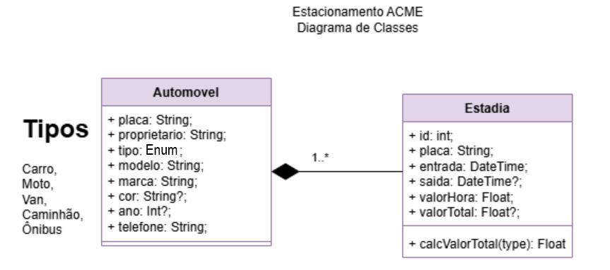

# Estacionamento - API
Projeto Backend para gerenciamento de estacionamento. Modelo de projeto para aulas de desenvolvimento de APIs com Node.js, Express e Prisma.

## Tecnologias Utilizadas
- Node.js
- Express
- Prisma
- MySQL - MariaDB

## Funcionalidades
- Cadastro de veículos
- Registro de entradas e saídas de veículos

## Como Executar Localmente
- 1 Clone o repositório, crie o arquivo `.env` com as variáveis de ambiente necessárias
```js
DATABASE_URL="mysql://root@localhost:3306/estacionamentoapi?schema=public&timezone=UTC"
JWT_SECRET="my_secret"
```
- 2 Altere a linha 2 do `prisma/schema.prisma` para usar o MySQL
```prisma
datasource db {
  provider = "mysql"
  url      = env("DATABASE_URL")
}
```
- 3 Instale as dependências: `npm install`
- 4 Implante o Banco de Dados `npx prisma migrate dev --name init`
- 5 Inicie o servidor: `npm run dev`

## Rotas

### Veículos
- `GET /veiculos` - Listar todos os veículos
- `GET /veiculos/:placa` - Buscar veículo por placa
- `POST /veiculos` - Criar novo veículo
- `PATCH /veiculos/:placa` - Atualizar veículo por placa
- `DELETE /veiculos/:placa` - Deletar veículo por placa

### Estadias
- `GET /estadias` - Listar todas as estadias
- `GET /estadias/:id` - Buscar estadia por ID
- `POST /estadias` - Criar nova estadia
- `PATCH /estadias/:id` - Atualizar estadia por ID
- `DELETE /estadias/:id` - Deletar estadia por ID
