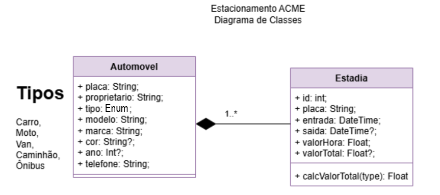

# Estacionamento - API
Projeto Backend para gerenciamento de estacionamento. Modelo de projeto para aulas de desenvolvimento de APIs com Node.js, Express e Prisma.

## Tecnologias Utilizadas
- Node.js
- Express
- Prisma
- MySQL - MariaDB

## Funcionalidades
- Cadastro de veículos
- Registro de entradas e saídas de veículos

## Como Executar Localmente
- 1 Clone o repositório, crie o arquivo `.env` com as variáveis de ambiente necessárias
```js
DATABASE_URL="mysql://root@localhost:3306/estacionamentoapi?schema=public&timezone=UTC"
```
- 2 Implante o Banco de Dados `npx prisma migrate dev --name init`
- 3 Instale as dependências: `npm install`
- 4 Inicie o servidor: `npm run dev`